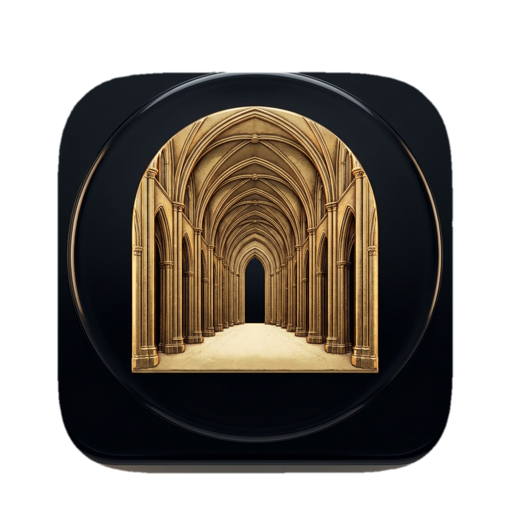

<p align="center"></p>

# Nave

*Where the sound resonates — impulse-response cabinet simulation for guitar and bass DI.*

[](https://github.com/basilica-audio/nave/actions/workflows/ci.yml)
[](https://www.gnu.org/licenses/agpl-3.0)

> **Work in progress.** Nave is pre-1.0 and under active development. Binaries for macOS and Windows are available from the [Releases](../../releases) page (currently unsigned — see the release notes); building from source works too. Expect breaking changes until v1.0.0 ships (see [Roadmap](#roadmap)).

<!-- ==BEGIN BODY== (plugin engineer: replace this block with What it is / Features / Signal flow / Roadmap) -->
## What it is

Nave is a cabinet impulse-response (IR) loader built on JUCE 8, aimed at reamping guitar and bass DI tracks: load a cab (or full-rig) IR captured from a real speaker/mic setup and Nave convolves it with your DI signal using a zero-latency partitioned convolution engine, then shapes the result with a simulated mic-distance control, a pair of post-convolution filters, a dry/wet mix, and an output trim. With no IR loaded, Nave runs a unit-impulse (delta) IR - mathematically a passthrough - so it is a valid, transparent effect straight out of the box. See [`docs/manual.md`](docs/manual.md) for the full user manual.

## Features

- **IR loading, two independent slots** - load any WAV/AIFF impulse response into IR A and/or IR B via file choosers; loading happens off the audio thread and never blocks or allocates during playback
- **IR Blend** - crossfades between IR A and IR B (e.g. two cabs, or two mic positions on the same cab), with automatic inter-IR phase alignment so blending never introduces comb-filtering from a timing mismatch between the two IRs
- **Zero-latency convolution** - `juce::dsp::Convolution`'s zero-latency uniformly partitioned algorithm for both IR slots, so Nave never adds plugin delay compensation overhead
- **Distance** - simulated mic-to-cab distance (a front-loaded proximity-effect bass cut plus high-frequency darkening - driven far more by loudspeaker directivity than literal air absorption at reamping distances - as the value increases); an explicit "off" position at its default
- **Presets** - 8 factory presets plus full user preset save/load/import/export (single files and zip banks), with German frame-string localisation
- **LoCut** - post-convolution high-pass, 20 Hz - 800 Hz (default 20 Hz, an explicit "off"/bypassed position), removes low-end mud
- **HiCut** - post-convolution low-pass, 2 kHz - 20 kHz (default 20 kHz, also an explicit "off" position), tames fizz
- **Mix** - dry/wet, default 100% (fully wet) - a cabinet IR is normally run fully in the signal path
- **Level** - output trim, -24 dB to +24 dB
- Full state save/recall via `AudioProcessorValueTreeState`, including both loaded IRs' file paths

## Signal flow

```
Input --> Convolution (crossfade of IR A / IR B) --> Distance --> LoCut (HPF, 20-800 Hz) --> HiCut (LPF, 2-20 kHz)
                                                                                                      |
                                    Output <-- Level (output trim) <-- Mix <------------------------ +
                                                                          ^
                                                                          |
                                                              delay-compensated dry path
```

See [`docs/architecture.md`](docs/architecture.md) for the full breakdown, including the convolution/latency strategy, the filter-bypass-at-range-extremes design, inter-IR phase alignment, and IR file state handling.

## Parameters

| Parameter | Range | Default | Unit | Description |
|---|---|---|---|---|
| LoCut | 20 – 800 | 20 (off) | Hz | Post-convolution high-pass filter; bypassed entirely at its minimum. |
| HiCut | 2000 – 20000 | 20000 (off) | Hz | Post-convolution low-pass filter; bypassed entirely at its maximum. |
| IR Blend | 0 – 100 | 0 (IR A only) | % | Crossfades between IR A and IR B. |
| Distance | 0 – 100 | 0 (off) | % | Simulated mic-to-cab distance coloration; bypassed entirely at its minimum. |
| Mix | 0 – 100 | 100 (fully wet) | % | Dry/wet blend against the original input. |
| Level | -24 – +24 | 0 | dB | Output trim, applied last. |

Full musical context and usage tips: [`docs/manual.md`](docs/manual.md).

## Roadmap

| Milestone | Description | Status |
|---|---|---|
| M0 | Bootstrap - project skeleton, CI, docs | Done |
| M1 | DSP completion & test coverage - IR Blend, Distance emulation, inter-IR phase alignment, broadened Catch2 suite | Done (IR browser + bundled IR library deferred - see issue tracker) |
| M2 | Presets & state recall - preset system, factory presets, DE frame localisation | Done |
| M3 | GUI & accessibility - custom LookAndFeel, accessibility pass | Planned |
| M4 | Release - code signing, notarization, installers, v1.0.0 | Planned |
<!-- ==END BODY== -->

## Installation

No pre-built binaries are published yet (see the work-in-progress notice above). Once releases begin, installation will follow the standard plugin locations:

**macOS**

| Format | Path |
|---|---|
| AU (Component) | `~/Library/Audio/Plug-Ins/Components/` |
| VST3 | `~/Library/Audio/Plug-Ins/VST3/` |

If Logic Pro doesn't pick up the plugin after installing, force a rescan by resetting the AU cache:

```sh
killall -9 AudioComponentRegistrar
auval -a
```

**Windows**

| Format | Path |
|---|---|
| VST3 | `C:\Program Files\Common Files\VST3\` |

## Building from source

Requires JUCE 8.0.14, C++20, and CMake ≥ 3.24. See [`docs/building.md`](docs/building.md) for full prerequisites and step-by-step build/test commands for macOS and Windows.

```sh
cmake -B build -G Ninja -DCMAKE_BUILD_TYPE=Release
cmake --build build
ctest --test-dir build --output-on-failure
```

## License

Nave is licensed under the [GNU Affero General Public License v3.0](LICENSE) (AGPLv3).

This project uses [JUCE](https://juce.com) 8, whose open-source tier is licensed under AGPLv3 (as of JUCE 8; JUCE 7 and earlier used GPLv3), which is why this project is AGPLv3 rather than GPLv3. See [`docs/adr/0002-agplv3-licensing.md`](docs/adr/0002-agplv3-licensing.md) for the full reasoning.

VST is a registered trademark of Steinberg Media Technologies GmbH.

Nave is an independent open-source project and is not affiliated with, endorsed by, or sponsored by any plugin manufacturer.
