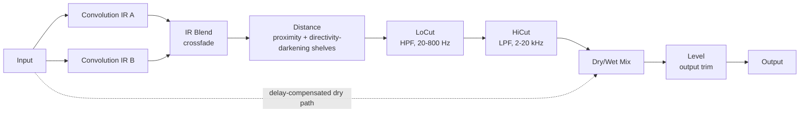

# Architecture

## Signal flow

Everything from the convolution through HiCut is the "wet" path, owned by `CabConvolutionEngine` (`src/dsp/CabConvolutionEngine.{h,cpp}`). The dry path is the untouched input signal, delayed to stay time-aligned with the wet path (see [Latency and the convolution engine](#latency-and-the-convolution-engine) below), then blended in at the Mix stage via `juce::dsp::DryWetMixer`. Level is applied last, after the mix, as a straightforward output trim.

## Module map

| Directory | Responsibility |
|---|---|
| `src/dsp` | All audio-thread DSP: `CabConvolutionEngine` (two convolution slots + IR Blend crossfade, Distance shelving filters, LoCut/HiCut filters, dry/wet mix, output level) and `IrAlignment` (pure, off-audio-thread helper functions for inter-IR phase alignment). No allocation, locks, or file I/O once `prepare()` has run. Independent of `juce::AudioProcessor` so it is directly unit-testable (see `tests/EngineTests.cpp`, `tests/IrAlignmentTests.cpp`). |
| `src/params` | Parameter layout and `AudioProcessorValueTreeState` definitions - parameter IDs, ranges, defaults. Single source of truth for what a preset captures (aside from the IR file paths, which are not APVTS parameters - see [IR file loading and state](#ir-file-loading-and-state)). |
| `src/presets` | The M2 suite-wide preset system (`.scaffold/specs/preset-system-m2.md`): `PresetManager` (factory/user preset discovery, load/save/import/export, dirty tracking, default resolution) and `PresetBar` (its editor strip), plus `Localisation` (the M2 i18n frame). Written with no Nave-specific coupling beyond a small config struct passed in from `PluginProcessor.cpp` - see `docs/preset-system-notes.md` for the sibling-plugin replication recipe. |
| `src/PluginProcessor.*` | Host plumbing: APVTS construction, `prepareToPlay`/`processBlock`/`reset`, latency reporting, state save/load, IR file I/O for both slots (`loadImpulseResponseFromFile[B]`/`loadDefaultImpulseResponse[B]`), and constructing/owning `presetManager`. Reads APVTS values and pushes them into `CabConvolutionEngine` every block; does not implement any DSP itself. |
| `src/PluginEditor.*` | A simple, functional v0.1/v0.2 GUI: a `PresetBar` strip docked at the top, one rotary slider per parameter bound via `SliderAttachment`, plus "Load IR.../Default" and "Load IR B.../Default" button pairs and labels showing each loaded IR's file name. A custom vector-drawn GUI is a later milestone. |

Dependency direction is one-way: `PluginEditor` -> `params` + `presets` (via attachments/PresetBar) and `PluginProcessor` -> `params` + `dsp` + `presets`. `src/params` depends on `src/dsp` only for its `CabConvolutionEngine::loCutMinHz`/`loCutMaxHz`/`hiCutMinHz`/`hiCutMaxHz`/`distanceMinPercent`/`distanceMaxPercent` range constants, so the parameter ranges and the engine's own bypass-threshold logic can never drift out of sync. `src/dsp` itself has no upward dependency on the processor, params, presets, or UI, which is what keeps `CabConvolutionEngine` testable in isolation and free of any file-I/O concerns. `src/presets` has no downward dependency on `src/dsp`/`src/params` either - it only knows about `juce::AudioProcessorValueTreeState`'s generic API, which is what makes it portable to sibling plugins.

## Filter bypass at the range extremes

LoCut's default (its range minimum, 20 Hz), HiCut's default (its range maximum, 20 kHz), and Distance's default (its range minimum, 0%) are each an explicit "off" position: rather than merely computing an extreme-but-still-active filter cutoff/gain, `CabConvolutionEngine::process()` skips that filter's IIR processing entirely whenever the smoothed value is within its bypass epsilon of the extreme. This is a deliberate design choice, not an incidental optimisation - even a 2nd-order Butterworth filter with a cutoff many octaves outside a test tone's frequency still imposes a small, real phase shift (asymptotically proportional to the inverse of the frequency ratio), which is enough to defeat a strict sample-domain null test long before the ratio becomes impractically large for a plugin's real parameter range. Skipping the filter entirely at the extremes guarantees the plugin's default state - and any explicit "LoCut/HiCut wide open, Distance off" setting - is a true, bit-accurate passthrough (down to floating-point precision), which is exactly what `tests/EngineTests.cpp`'s and `tests/CoverageTests.cpp`'s null tests verify.

When a filter transitions from bypassed to engaged, `CabConvolutionEngine::process()` resets that filter's IIR state first (Distance's two shelving filters are reset together, since they share a single bypass gate driven by one parameter), so it always starts from a clean, predictable state rather than reusing whatever memory it was left in an arbitrary number of blocks ago. This is a deliberate simplification: it produces a normal filter turn-on transient (the same kind any IIR filter has starting from silence) rather than attempting to avoid it, which would require cross-fading between bypassed and engaged paths.

IR Blend uses an analogous, but *value-driven rather than range-extreme*, optimisation: `convolutionB.process()` only runs when Blend is above a small epsilon above 0%, since IR A alone is the entire signal at Blend = 0%. Unlike LoCut/HiCut/Distance, Blend = 0% is not a special-cased "different code path" for correctness reasons - it falls out naturally from the crossfade math (`a * (1 - blend) + b * blend`) - skipping IR B's convolution there is purely a CPU optimisation, verified by `tests/EngineTests.cpp`'s "IR Blend at 0%" test.

**LoCut/HiCut ranges are a deliberate keep, not an oversight.** `docs/design-brief.md`'s v0.2.0 pass considered narrowing both ranges to match the closest structural reference plugin (Ignite Amps NadIR: 10-400 Hz HPF / 6-22 kHz LPF) and explicitly rejected it: Nave's wider LoCut ceiling (800 Hz) and lower HiCut floor (2 kHz) give headroom for deliberately extreme "telephone/lo-fi" tones, and narrowing would be a pure regression with no sourced justification for removing that headroom. `tests/EngineTests.cpp` has a named test asserting these four constants explicitly, as insurance against silent range drift now that the reasoning is documented here rather than only inside `CabConvolutionEngine.h`.

## IR Blend and inter-IR phase alignment

`CabConvolutionEngine` owns two independent `juce::dsp::Convolution` instances ("IR A" and "IR B"), each with its own default (zero-latency) configuration and its own default delta IR. `process()` always runs IR A; it additionally runs IR B (into a pre-allocated scratch buffer sized in `prepare()`, never resized on the audio thread) and crossfades the two per-block whenever the smoothed IR Blend value is above a small epsilon - see [Filter bypass at the range extremes](#filter-bypass-at-the-range-extremes) above. If a host ever sends a block larger than `prepare()` promised, the scratch buffer's capacity is checked before writing into it; if the block wouldn't fit, Blend is simply treated as disengaged for that one block (falling back to IR A only) rather than risking an out-of-bounds write.

Both branches are independently convolved from the *same* original (dry) input, not chained: when Blend is engaged, `process()` copies the pre-convolution samples into the scratch buffer *before* `convolution.process()` (IR A) mutates `block` in place, so `convolutionB.process()` (IR B) always sees the untouched dry signal rather than IR A's already-convolved output. Getting this ordering wrong would silently turn the "B" side of the crossfade into `IR_B(IR_A(input))` - a cascaded double convolution - instead of the intended `IR_B(input)`; this is exactly the symmetric parallel A/B blend the diagram above depicts, and is covered by `tests/EngineTests.cpp`'s IR Blend tests using two distinct (non-identity) IRs in both slots.

Two independently-captured impulse responses rarely share the same "time zero" - different mic distances, different capture/measurement setups - so naively crossfading them would partially cancel a wide band of frequencies (comb filtering) wherever their transients don't line up. `CabConvolutionEngine::setImpulseResponseB()` addresses this with **inter-IR phase alignment**: before IR B is loaded into `convolutionB`, `IrAlignment::alignOnsetToReference()` (`src/dsp/IrAlignment.{h,cpp}`) time-shifts it so its detected onset lines up with IR A's most recently recorded onset (`lastIrAOnsetSample`/`lastIrASampleRate`, updated by `setImpulseResponse()`/`loadDefaultImpulseResponse()`). Onset detection is a simple, cheap relative-threshold crossing (the first sample, across all channels, whose magnitude reaches 20% of the buffer's own peak) - deliberate given cabinet IRs have one dominant direct-sound transient, rather than a full cross-correlation search. Alignment is computed in *time* (seconds), not raw sample index, so it stays correct even when IR A and IR B are captured at different sample rates. All of this happens off the audio thread (`setImpulseResponseB()`'s documented contract, same as `setImpulseResponse()`) - see `tests/IrAlignmentTests.cpp` for direct coverage of the alignment math, and `tests/EngineTests.cpp`'s IR Blend tests for the end-to-end engine behaviour.

## Distance emulation

The Distance parameter is a deliberately simplified, musically-motivated approximation of moving a mic further from a cabinet, not a physically exact model - it applies no timing/pre-delay change, only two shelving filters (`distanceLowShelfFilter`, `distanceHighShelfFilter`), applied post-convolution/post-Blend and pre-LoCut/HiCut so a user's own tone-shaping filters always act on top of whatever Distance coloration is dialled in, not the other way around: a low-shelf cut around 200 Hz (reduced proximity-effect bass buildup as the simulated mic moves away) and a high-shelf cut around 5 kHz (high-frequency darkening - see the "v0.2.0 Distance taper" note below on why this is framed as directivity-driven, not "air absorption"). Both are driven by a single parameter and share one bypass gate (see above).

**v0.2.0 Distance taper** (`docs/design-brief.md`'s "Distance" module spec): the low-shelf's gain no longer scales linearly against the normalised Distance value - real proximity effect is front-loaded (research: "accelerates exponentially... then saturates" as a mic gets closer), so `CabConvolutionEngine.cpp`'s `tapered()` helper applies an "ease-out" power curve (`1 - (1 - normalisedDistance)^1.8`) that concentrates most of the audible cut into roughly the first third of the knob's travel and flattens out approaching 100%. The high-shelf deliberately keeps its plain-linear taper: Two Notes' own reference model attributes off-axis darkening to a *separate* control (their Center) from distance, so Nave's single-knob high-shelf is already a simplification of that other axis, not the front-loaded proximity effect - see `CabConvolutionEngine::distanceLowShelfTaperExponent`'s doc comment and `docs/design-brief.md`'s Honesty section for the full rationale and what this taper shape is/isn't calibrated against. This is a parameter-*behavior*-breaking change pre-1.0 (same Distance range/default, different curve) - see `CHANGELOG.md`.

Also worth knowing when loading impulse responses: `juce::dsp::Convolution::Normalise::yes` (used for every user-loaded IR) is an *energy* normalisation, not a perceptual loudness match - two different real-world cab IRs can land at different post-load output levels purely because of how their energy is distributed, independent of anything Distance/LoCut/HiCut/Blend do. See `docs/manual.md`'s "Loading impulse responses" section for the user-facing version of this callout, and `tests/EngineTests.cpp`'s comment near its IR-loading tests for the sourced reference (JUCE forum, `normalizationFactor = 0.125f / sqrt(sumOfSquaredMagnitudes)`).

## Latency and the convolution engine

`CabConvolutionEngine` constructs both `juce::dsp::Convolution` instances (IR A and IR B) with their default configuration (`Latency{0}`), which selects the zero-latency uniformly partitioned convolution algorithm - the shortest-latency option JUCE offers, at the cost of higher CPU use than the fixed-latency or non-uniform alternatives (both of which trade some added, fixed delay for lower CPU). This is the right trade-off for a cabinet IR loader: cab IRs used for reamping are short (typically well under a second, often just a few hundred milliseconds), and reamping workflows are latency-sensitive (the plugin sits directly in a tracking chain), so keeping latency at zero is worth the CPU cost. `CabConvolutionEngine::getLatencySamples()` returns `juce::jmax(convolution.getLatency(), convolutionB.getLatency())` - in practice always zero, since both slots always use the same zero-latency configuration, but computed generically so the dry path stays correctly compensated if a slot's configuration ever changes independently in future. `NaveAudioProcessor::prepareToPlay()` reports this to the host via `setLatencySamples()`, so host-side plugin delay compensation (PDC) accounts for the whole chain.

The dry path used by the Mix control still needs to stay time-aligned with the wet path in general (in case a future milestone ever changes the convolution configuration), so `CabConvolutionEngine` uses `juce::dsp::DryWetMixer` rather than a hand-rolled delay line: the pre-processing signal is captured via `pushDrySamples()` before the convolution or filters touch the buffer, and `setWetLatency(getLatencySamples())` configures the mixer's internal delay line to match (currently always 0). `mixWetSamples()` then blends the two back together, so at Mix = 100% the output is (once the filters are bypassed, per above) a sample-accurate passthrough of the input - the exact scenario `tests/EngineTests.cpp`'s null tests verify, to well under -80 dBFS residual.

One JUCE 8.0.14 behaviour worth calling out because it cost real debugging time in a sibling plugin (see `tests/DryWetMixerContractTests.cpp` in `tight-boost`, a same-author sibling of this plugin, for the full regression coverage): `DryWetMixer`'s internal dry/wet gain smoothers default their *target* to fully wet (`mix == 1.0`) until `setWetMixProportion()` is called, and the mixer's own `reset()` (invoked from its `prepare()`) only snaps the smoothers' *current* value to whatever *target* is set at that moment - it has no idea what the "real" starting Mix parameter value should be. `CabConvolutionEngine::prepare()` works around this by calling `dryWetMixer.setWetMixProportion(lastMixProportion)` *before* its own `reset()` runs, so the mixer is already sitting at the correct dry/wet balance from the very first `process()` call, regardless of what Mix was set to.

## Asynchronous IR loading

`juce::dsp::Convolution::loadImpulseResponse()` is documented as wait-free (the call itself never blocks or allocates on the calling thread), but the actual work of building the new convolution engine from the loaded IR happens **asynchronously**, on a background thread owned by the `Convolution`'s internal `ConvolutionMessageQueue`. Immediately after `loadImpulseResponse()` returns, `process()` may still be running the *previous* IR for some number of blocks - this is by design, and lets a live IR swap mid-playback cross-fade smoothly rather than glitching.

The one point at which a newly loaded IR is *guaranteed* to be synchronously installed is the next call to `Convolution::prepare()`: internally, `prepare()` first drains (and synchronously executes) any pending load command before rebuilding the active engine from whatever IR is now current. `CabConvolutionEngine` relies on this in two places: `prepare()` itself always loads before preparing both slots (per the class's own documented contract), and any test or caller that needs a freshly loaded IR to be active *before the very next `process()` call* (rather than fading in over a live session) must call `prepare()` again after `setImpulseResponse[B]()`/`loadDefaultImpulseResponse[B]()` - see `tests/EngineTests.cpp`'s convolution-change and IR Blend tests. In normal plugin use this doesn't matter: a user loading a new IR via the editor while the host is playing gets the intended smooth, glitch-free cross-fade instead.

## Convolution engine retention across `prepare()`

`juce::dsp::Convolution` internally retains the most recently loaded impulse response (and its original sample rate) across calls to `prepare()`, automatically re-resampling it against whatever new `ProcessSpec::sampleRate` is supplied. `CabConvolutionEngine::prepare()` relies on this for both slots: it only calls `loadDefaultImpulseResponse()`/`loadDefaultImpulseResponseB()` the first time each slot is ever prepared (tracked via `anyImpulseResponseLoaded`/`anyImpulseResponseBLoaded`), not on every re-prepare (sample-rate change, etc.) - a previously loaded user IR survives a sample-rate change without needing to be manually reloaded.

## IR file loading and state

The currently loaded IR files' absolute paths are **not** `AudioProcessorValueTreeState` parameters - a file path has no meaningful float representation, and APVTS parameters are designed for continuously automatable values. Instead, `NaveAudioProcessor::loadImpulseResponseFromFile()`/`loadImpulseResponseFromFileB()` store them directly as plain properties (`ParamIDs::irFilePathProperty`/`irFilePathBProperty`) on the live `apvts.state` `ValueTree`. Because `AudioProcessorValueTreeState::copyState()`/`replaceState()` preserve arbitrary tree properties (not just the parameter child nodes they manage), these paths round-trip through the normal `getStateInformation()`/`setStateInformation()` flow without any extra serialisation code.

`loadImpulseResponseFromFile[B]()` perform blocking file I/O (via `juce::AudioFormatManager`/`AudioFormatReader`) and must only be called off the audio thread - from the editor's `juce::FileChooser` callbacks (message thread) or from `setStateInformation()` (a session/preset-load operation, which JUCE guarantees is never called from the audio thread). The resulting `juce::AudioBuffer<float>` is then moved into `CabConvolutionEngine::setImpulseResponse()`/`setImpulseResponseB()`, which forward it (after phase alignment, for slot B - see [IR Blend and inter-IR phase alignment](#ir-blend-and-inter-ir-phase-alignment)) to `juce::dsp::Convolution::loadImpulseResponse()` - a call documented by JUCE as wait-free, so it is safe regardless of which thread ultimately invokes it, even though this plugin only ever calls it from the message thread.

`setStateInformation()` reads the restored `irFilePathProperty` after `apvts.replaceState()` and, if it points at a file that still exists, calls `loadImpulseResponseFromFile()` again to bring IR A's loaded IR back in sync with the restored state (falling back to `loadDefaultImpulseResponse()` if the stored path is empty or the file no longer exists); it then does the same for IR B via `irFilePathBProperty`/`loadImpulseResponseFromFileB()`/`loadDefaultImpulseResponseB()`. IR A is always restored first, so it becomes the phase-alignment reference IR B is loaded against - matching how the two are loaded during normal interactive use.

## Parameter smoothing

- **LoCut** and **HiCut** are filter cutoff frequencies. Recomputing IIR coefficients involves trig calls, so these are not cheap to interpolate per sample; instead, each is smoothed with a `juce::SmoothedValue<float, ValueSmoothingTypes::Multiplicative>` (multiplicative smoothing suits frequencies, which are perceived logarithmically) and the filter coefficients (when not bypassed) are recomputed once per block from the smoothed value - a standard real-time-safe compromise.
- **Distance** is smoothed with a `juce::SmoothedValue<float, ValueSmoothingTypes::Linear>` (it's a percentage, not a frequency); the two shelving filters' coefficients (when not bypassed) are likewise recomputed once per block from the smoothed value.
- **IR Blend** is smoothed with its own `juce::SmoothedValue<float, ValueSmoothingTypes::Linear>` and applied as a simple per-block scalar crossfade (`a * (1 - blend) + b * blend`) - the same once-per-block granularity as the filter coefficients above, not a per-sample ramp, which is an acceptable trade-off given Blend is a slow, occasional tonal adjustment rather than a fast-moving control.
- **Level** is a plain gain stage (`juce::dsp::Gain<float>`), which ramps sample-accurately via its own internal `SmoothedValue` (`setRampDurationSeconds`).
- **Mix** is smoothed both by the engine's own `juce::SmoothedValue<float, ValueSmoothingTypes::Linear>` (feeding `DryWetMixer::setWetMixProportion()` once per block) and by `DryWetMixer`'s own internal ~50 ms ramp on top of that.
- All smoothers are seeded to their real starting value in `CabConvolutionEngine::prepare()` (see `lastLoCutHz`/`lastHiCutHz`/`lastMixProportion`/`lastBlendProportion`/`lastDistancePercent`), so re-preparing (sample-rate change, etc.) never resets a live parameter back to a built-in default or lets a smoother ramp from an invalid starting point.

## Real-time safety

- `NaveAudioProcessor::processBlock()` starts with `juce::ScopedNoDenormals`.
- All DSP state (both convolution engines, filters, the dry/wet delay line, the IR Blend scratch buffer) is allocated in `prepare()`/`prepareToPlay()` and never reallocated on the audio thread.
- `reset()` clears all filter/convolution/delay-line state without deallocating (`CabConvolutionEngine::reset()`, called from both `AudioProcessor::reset()` and internally from `prepare()`).
- Parameter values are read via `apvts.getRawParameterValue()` atomics in `processBlock()`, never via `apvts.getParameter()->getValue()` (which is not guaranteed lock/allocation-free) and never via `String`-keyed lookups on the audio thread.
- `CabConvolutionEngine::process()` treats a zero-sample block as a safe no-op before touching any filter/convolution state, and defensively falls back to treating IR Blend as disengaged (rather than risking an out-of-bounds write) if a block ever arrives larger than the scratch buffer `prepare()` sized for it.
- IR file loading (`loadImpulseResponseFromFile[B]`) is only ever invoked from the message thread (editor) or from `setStateInformation()` (session/preset load) - never from `processBlock()`. The actual `juce::dsp::Convolution::loadImpulseResponse()` call it makes is documented as wait-free regardless. The inter-IR phase-alignment functions it depends on (`IrAlignment::*`) allocate and are likewise only ever called from those same off-audio-thread contexts.
- Filter/shelf cutoff frequencies passed to `IIR::Coefficients::makeHighPass`/`makeLowPass`/`makeLowShelf`/`makeHighShelf` are clamped below Nyquist where applicable (`clampBelowNyquist`, in `CabConvolutionEngine.cpp`) as defensive insurance against invalid coefficients if the plugin is ever prepared at an unusually low sample rate.
